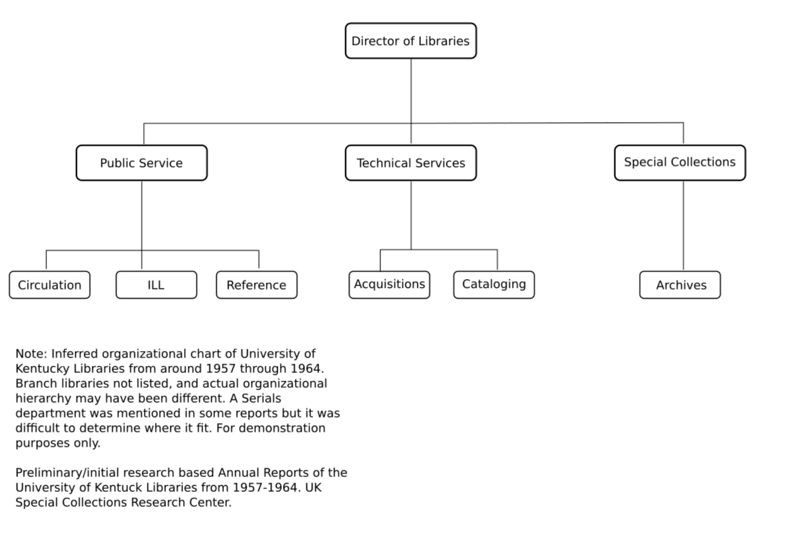

# Acquisitions and Collections Development

By the end of this section, you will understand that:

- Format influences acquisition and access workflows.
- Electronic resources have necessitated more specialized roles within libraries.
- Collection Development Policies (CDPs) are crucial for managing electronic resources effectively.
- OER initiatives are growing, and libraries may need to decide how deeply to involve themselves in the acquisition and cataloging of these resources.

## Introduction

Collection development and acquisitions have become more complex with the rise of electronic resources.
In contrast to the more linear acquisition processes of collecting print resources,
electronic resources require different contractual and technological considerations.
Librarians now must navigate issues like differing licensing agreements and the complex technologies involved
in handling electronic resources like ebooks, journal articles, databases, etc.
This shift from print to electronic has fundamentally transformed collection workflows.
As [Martin et al. (2009)][martin2009] highlight:

> As much as we would like to think our primary concerns about collecting are based on content, not **format** [emphasis added],
> e-resources have certainly challenged many long-established notions of how we buy, collect, preserve,
> and provide access to information (p. 217).

## Collection Development

The conventional wisdom is that content, not format, should be the focus of collection management.
[Harloe &amp; Budd (1994)][harloe1994] argue that "collection managers should focus on the content of the information provided,
regardless of the actual form in which the information arrives" (p. 83).
However, this perspective overlooks practical considerations.
Format impacts cost, licensing, and ultimately, accessibility.
If format matters, we need to ask: how does format either prevent or facilitate access?
This question links acquisitions, collections development, and usability, since usability is an access issue.
We'll address usability specifically in a later section.

In a collection development course, you might primarily focus on content.
You would also consider the work involved in creating a collection development policy (CDP).
Content and CDPs are key to the acquisition, collection, and management of e-resources.
However, it is equally important to understand how the management of electronic resources
has affected librarian workflows and reshaped library organizational hierarchies.

### Organizational Hierarchy

The complexity of library organizational hierarchies has increased with the rise of electronic resources.
I developed an organizational chart based on librarian departmental reports written during the late 1950s and early 1960s
at the University of Kentucky.
This time period was obviously before the advent of electronic resources.
These reports are archived at the University of Kentucky's [Special Collections Research Center][speccoll].
While organizational charts have been around since the 1800s, they became more commonly used in libraries only in the latter half of the 20th century.
Based on my research, I **inferred** an organizational structure during that period (see Fig. 1).

<figure>

<figcaption>
Fig. 1. This is a derived organizational chart based on annual reports of University of Kentucky departmental head librarians.
Research is based on reports held at the UK Library's Special Collections Research Center. 
</figcaption>
</figure>

> The concept of organizational charts dates back to the 19th century.
> The first known chart was created in 1855 by Daniel McCallum, a railway general superintendent.
> McCallum, with the assistance of a draftsman and civil engineer named George Holt Henshaw,
> designed an organizational chart for the New York and Erie Railway to showcase the division of administrative duties and
> the number and class of employees engaged in each department ([Organimi 2020][organimi2020]; [Lanteria 2021][lanteria2021]).
> This chart was initially referred to as a "Diagram representing a plan of organization" and
> was not yet called an organizational chart ([Organimi 2020][organimi2020], [Pingboard][pingboard]).
> 
> The terminology "organization chart" became more common in the early 20th century, and
> by 1914 a certain Brinton advocated for broader use of organizational charts ([Wikipedia Organizational Chart][org-wikipedia]).
> The use of organizational charts gained more traction in industrial engineering circles and
> became more popular among businesses and enterprises in the latter half of the 20th century ([Miro 2021][miro2021]).
>
> These early developments set the stage for modern organizational charts,
> which have now become crucial tools for delineating responsibilities, hierarchy, and
> the structural framework within organizations across various sectors.
> From a historical perspective, a study of organizational charts of the years can shed insight on how the organization evolves,
> especially when cross-referencing that evolution with other changes,
> such as the introduction of electronic resources in libraries.

Comparing my chart to a more [recent one provided by UK Libraries][ukorg] shows additional complexity.
The growth in electronic resources, associated technologies, and markets explains much of this complexity.
New specialized roles have emerged to manage these resources, including digital content specialists and e-resource managers.
Additionally, larger and more diverse student populations have influenced library structure,
as have evolving theories and practices of library management.

But again, consider the influence of format.
Technology and electronic resources account for a substantial part of the increasing complexity seen in modern organizational charts.
[Lamothe (2015)][lamothe2015] finds that continuously updated electronic reference resources maintain high usage,
whereas static e-resources see declining use.
This raises questions about the expectations patrons have regarding content freshness.
This type of dynamism, directly influenced by format, no doubt increases the complex requirements needed to manage e-resources.

## Open Educational Resources

Now let's discuss Open Educational Resources (OER), a hot topic in today's academic libraries.
Textbook prices, [England et al. (2017)][england2017] note, have skyrocketed in recent decades.
College students' budget are [up to $1,240 per year in books and supplies][collegeboard].
[Public elementary and secondary schools][statistica] expend nearly 2.5 billion dollars per year on textbooks.
In response, libraries have notably moved to highlight open educational resources at some level.
For example, UK Libraries provides resources about [Open Educational Resources][oer] and provide a LibGuide on [OER][oerlibguide].

Sites such as [oercommons.org][oer2], [openstax][openstax], [LibreTexts][libretexts], and
others function as digital libraries of open access educational resources.
These initiatives aim to reduce the costs associated with proprietary educational materials by providing high-quality, open access alternatives.
This book is itself an OER.

While OER initiatives are often pushed to faculty as alternatives to proprietary textbooks,
we should ask whether librarians should play a more direct role in acquiring these resources.
For example, should librarians catalog OER items and add them to library catalogs or discovery systems,
thereby promoting OER at a broader level (see [Hill & Bossaller, 2012][hill2013] for a comparable discussion)?
Traditionally, libraries, public or academic, have not collected textbooks.
Should they start now?
Would this transform their mission, or could it enhance their role as educational institutions?

> Aside: If interested in following developments in open educational resources,
> then I highly recommend subscribing to the [SPARC Open Education Forum email list][sparcOER].

## Collection Development Policies of Electronic Resources

A collection development policy (CDP) is crucial for guiding the collection, acquisition, and assessment of electronic resources.
Unfortunately, not all libraries have a CDP.
If you end up working at such a library, I highly encourage you to convince your colleagues of its importance.
A CDP should define a collection, and then include most if not all the following topics:

* Mission, vision, and values statement
* Purpose of CDP statement (scope may be included here)
* Selection criteria: general guidelines and specific considerations for populations, genres, resource types, etc.
* Assessment and maintenance criteria
* Criteria for challenged materials criteria (esp important at public, K-12 libraries)
* Weeding and/or replacement criteria

Librarians that have included electronic resources in their CDPs provide useful case studies.
For instance, two CDP policies, one from the [University of Louisiana (UL)][erpolicy] and one from the [Lexington Public Library (LPL)][lexpubpolicy],
contain sections on electronic resources.
The UL CDP is not their main policy but a sub-CDP that focuses on electronic resources.
The LPL's policy is their main policy.
Both approaches reflect the libraries' unique missions and communities.

> **Actionable Step**: If your library lacks a CDP, start by identifying collection gaps and
> collaborate with colleagues to create a vision for your collection.
> Draft a simple version and seek feedback for continuous improvement.

## Conclusion

This section addresses the complexities of collection development for electronic resources,
the impact of format on workflows and organizational hierarchies,
the role of OERs in libraries, and
the critical importance of collection development policies for e-resources.
Electronic resources have reshaped not only what libraries collect but how they organize and manage their staff and workflows.

## Readings / References

England, L., Foge, M., Harding, J., & Miller, S. (2017).
ERM ideas & innovations.
*Journal of Electronic Resources Librarianship, 29*(2), 110–116.
[https://doi.org/10.1080/1941126X.2017.1304767][england2017]

Lamothe, A. R. (2015).
Comparing usage between dynamic and static e-reference collections.
*Collection Building, 34*(3), 78–88.
[https://doi.org/10.1108/CB-04-2015-0006][lamothe2015]

Martin, H., Robles-Smith, K., Garrison, J., & Way, D. (2009).
Methods and strategies for creating a culture of collections assessment at comprehensive universities.
*Journal of Electronic Resources Librarianship, 21*(3–4), 213–236.
[https://doi.org/10.1080/19411260903466269][martin2009]

## Additional References

Harloe, B., & Budd, J. M. (1994).
Collection development and scholarly communication in the era of electronic access.
*The Journal of Academic Librarianship, 20*(2), 83–87.
[https://doi.org/10.1016/0099-1333(94)90043-4][harloe1994]

Hill, H., & Bossaller, J. (2013).
Public library use of free e-resources.
*Journal of Librarianship and Information Science, 45*(2), 103–112.
[https://doi.org/10.1177/0961000611435253][hill2013]

[collegeboard]:https://research.collegeboard.org/media/pdf/trends-in-college-pricing-student-aid-2022.pdf
[england2017]:https://doi.org/10.1080/1941126X.2017.1304767
[erpolicy]:https://library.louisiana.edu/about-us/policies-procedures/e-resources-serials-management
[harloe1994]:https://doi.org/10.1016/0099-1333(94)90043-4
[hill2013]:https://doi.org/10.1177/0961000611435253
[lamothe2015]:https://doi.org/10.1108/CB-04-2015-0006
[lanteria2021]:https://www.lanteria.com/news/complete-guide-making-organizational-chart
[lexpubpolicy]:https://www.lexpublib.org/collection-development-policy
[libretexts]:https://libretexts.org/
[martin2009]:https://doi.org/10.1080/19411260903466269
[miro2021]:https://miro.com/blog/organizational-chart/
[oer2]:https://www.oercommons.org/
[oer]:https://www.uky.edu/copyright/facultyresources/openeducationalresources
[oerlibguide]:https://libguides.uky.edu/c.php?g=222941&p=6722485
[openstax]:https://openstax.org/
[organimi2020]:https://www.organimi.com/the-evolution-of-org-charts/
[org-wikipedia]:https://en.wikipedia.org/wiki/Organizational_chart
[pingboard]:https://pingboard.com/org-charts/evolution-org-charts
[sparcOER]:https://sparcopen.org/our-work/sparc-oe-forum/
[speccoll]:http://libraries.uky.edu/SC
[statistica]:https://www.statista.com/statistics/741558/us-public-school-textbook-expenditure/
[ukorg]:https://web.archive.org/web/20190722033735/https://libraries.uky.edu/forms/OrgChart.pdf
